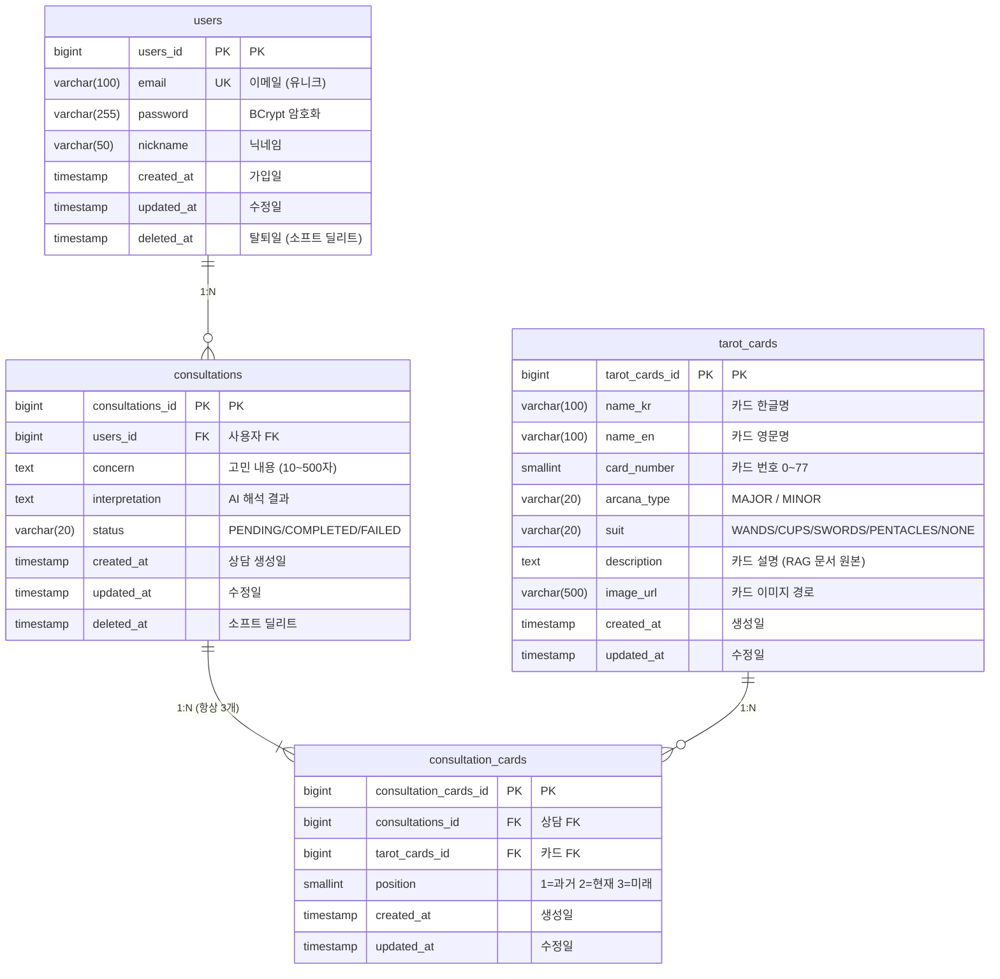

# Backend ERD 설계

## 엔티티 목록

| 테이블 | 설명 |
|---|---|
| users | 회원 정보 |
| tarot_cards | 타로 카드 마스터 데이터 (78장) |
| consultations | 상담 세션 (고민 + 해석 결과) |
| consultation_cards | 상담별 선택 카드 (상담당 3행 고정) |

---

## ERD



---

## 관계 정의

| 관계 | 설명 |
|---|---|
| users : consultations | 1:N — 한 유저가 여러 번 상담 가능 |
| consultations : consultation_cards | 1:N — 상담 1건당 카드 3장 고정 |
| tarot_cards : consultation_cards | 1:N — 같은 카드가 여러 상담에 등장 가능 |

---

## DDL (PostgreSQL)

```sql
-- updated_at 자동 갱신 트리거 함수 (공통)
CREATE OR REPLACE FUNCTION update_updated_at()
RETURNS TRIGGER AS $$
BEGIN
    NEW.updated_at = CURRENT_TIMESTAMP;
    RETURN NEW;
END;
$$ LANGUAGE plpgsql;

-- -----------------------------------------------
-- 1. users
-- -----------------------------------------------
CREATE TABLE users (
    users_id    BIGSERIAL       NOT NULL,
    email       VARCHAR(100)    NOT NULL,
    password    VARCHAR(255)    NOT NULL,
    nickname    VARCHAR(50)     NOT NULL,
    created_at  TIMESTAMP       NOT NULL DEFAULT CURRENT_TIMESTAMP,
    updated_at  TIMESTAMP       NOT NULL DEFAULT CURRENT_TIMESTAMP,
    deleted_at  TIMESTAMP,
    PRIMARY KEY (users_id),
    CONSTRAINT uq_users_email UNIQUE (email)
);

CREATE TRIGGER trg_users_updated_at
    BEFORE UPDATE ON users
    FOR EACH ROW EXECUTE FUNCTION update_updated_at();

COMMENT ON TABLE users IS '회원';
COMMENT ON COLUMN users.deleted_at IS '탈퇴일 (NULL이면 활성)';

-- -----------------------------------------------
-- 2. tarot_cards
-- -----------------------------------------------
CREATE TABLE tarot_cards (
    tarot_cards_id  BIGSERIAL       NOT NULL,
    name_kr         VARCHAR(100)    NOT NULL,
    name_en         VARCHAR(100)    NOT NULL,
    card_number     SMALLINT        NOT NULL,
    arcana_type     VARCHAR(20)     NOT NULL,
    suit            VARCHAR(20)     NOT NULL DEFAULT 'NONE',
    description     TEXT            NOT NULL,
    image_url       VARCHAR(500),
    created_at      TIMESTAMP       NOT NULL DEFAULT CURRENT_TIMESTAMP,
    updated_at      TIMESTAMP       NOT NULL DEFAULT CURRENT_TIMESTAMP,
    PRIMARY KEY (tarot_cards_id),
    CONSTRAINT uq_tarot_card_number UNIQUE (card_number),
    CONSTRAINT chk_arcana_type CHECK (arcana_type IN ('MAJOR', 'MINOR')),
    CONSTRAINT chk_suit CHECK (suit IN ('WANDS', 'CUPS', 'SWORDS', 'PENTACLES', 'NONE'))
);

CREATE TRIGGER trg_tarot_cards_updated_at
    BEFORE UPDATE ON tarot_cards
    FOR EACH ROW EXECUTE FUNCTION update_updated_at();

COMMENT ON TABLE tarot_cards IS '타로 카드 마스터 (78장)';
COMMENT ON COLUMN tarot_cards.description IS 'FAISS RAG 원본 문서';

-- -----------------------------------------------
-- 3. consultations
-- -----------------------------------------------
CREATE TABLE consultations (
    consultations_id    BIGSERIAL   NOT NULL,
    users_id            BIGINT      NOT NULL,
    concern             TEXT        NOT NULL,
    interpretation      TEXT,
    status              VARCHAR(20) NOT NULL DEFAULT 'PENDING',
    created_at          TIMESTAMP   NOT NULL DEFAULT CURRENT_TIMESTAMP,
    updated_at          TIMESTAMP   NOT NULL DEFAULT CURRENT_TIMESTAMP,
    deleted_at          TIMESTAMP,
    PRIMARY KEY (consultations_id),
    CONSTRAINT chk_consultation_status
        CHECK (status IN ('PENDING', 'COMPLETED', 'FAILED')),
    CONSTRAINT fk_consultations_users
        FOREIGN KEY (users_id) REFERENCES users (users_id)
);

CREATE TRIGGER trg_consultations_updated_at
    BEFORE UPDATE ON consultations
    FOR EACH ROW EXECUTE FUNCTION update_updated_at();

COMMENT ON TABLE consultations IS '상담 세션';
COMMENT ON COLUMN consultations.concern IS '고민 내용 (10~500자)';
COMMENT ON COLUMN consultations.interpretation IS 'AI 해석 결과 (PENDING 상태엔 NULL)';
COMMENT ON COLUMN consultations.deleted_at IS '소프트 딜리트 (NULL이면 활성)';

-- -----------------------------------------------
-- 4. consultation_cards
-- -----------------------------------------------
CREATE TABLE consultation_cards (
    consultation_cards_id   BIGSERIAL   NOT NULL,
    consultations_id        BIGINT      NOT NULL,
    tarot_cards_id          BIGINT      NOT NULL,
    position                SMALLINT    NOT NULL,
    created_at              TIMESTAMP   NOT NULL DEFAULT CURRENT_TIMESTAMP,
    updated_at              TIMESTAMP   NOT NULL DEFAULT CURRENT_TIMESTAMP,
    PRIMARY KEY (consultation_cards_id),
    CONSTRAINT uq_consultation_position
        UNIQUE (consultations_id, position),
    CONSTRAINT chk_position
        CHECK (position IN (1, 2, 3)),
    CONSTRAINT fk_cc_consultations
        FOREIGN KEY (consultations_id) REFERENCES consultations (consultations_id),
    CONSTRAINT fk_cc_tarot_cards
        FOREIGN KEY (tarot_cards_id) REFERENCES tarot_cards (tarot_cards_id)
);

CREATE TRIGGER trg_consultation_cards_updated_at
    BEFORE UPDATE ON consultation_cards
    FOR EACH ROW EXECUTE FUNCTION update_updated_at();

COMMENT ON TABLE consultation_cards IS '상담별 선택 카드 (상담당 3행 고정)';
COMMENT ON COLUMN consultation_cards.position IS '카드 위치: 1=과거 2=현재 3=미래';
```

---

## 인덱스 설정

```sql
-- 내 상담 목록 조회 시 풀스캔 방지
CREATE INDEX idx_consultations_users_id ON consultations (users_id);

-- 소프트 딜리트 필터링
CREATE INDEX idx_consultations_deleted_at ON consultations (deleted_at);

-- 상담별 카드 조회
CREATE INDEX idx_consultation_cards_consultations_id ON consultation_cards (consultations_id);
```

---

## 비즈니스 규칙 요약

| 규칙 | 적용 위치 |
|---|---|
| 상담당 카드는 반드시 3장 | `CHECK (position IN (1, 2, 3))` + 서비스 레이어 |
| 동일 상담에 같은 포지션 중복 불가 | `UNIQUE (consultations_id, position)` |
| 카드 번호 0~77 중복 불가 | `UNIQUE (card_number)` |
| 상담 기록 삭제는 소프트 딜리트 | `deleted_at` 컬럼 |
| 본인 상담만 조회 가능 | 서비스 레이어 (403 처리) |